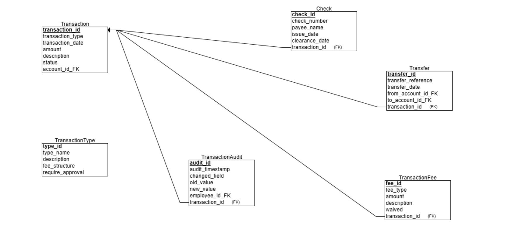
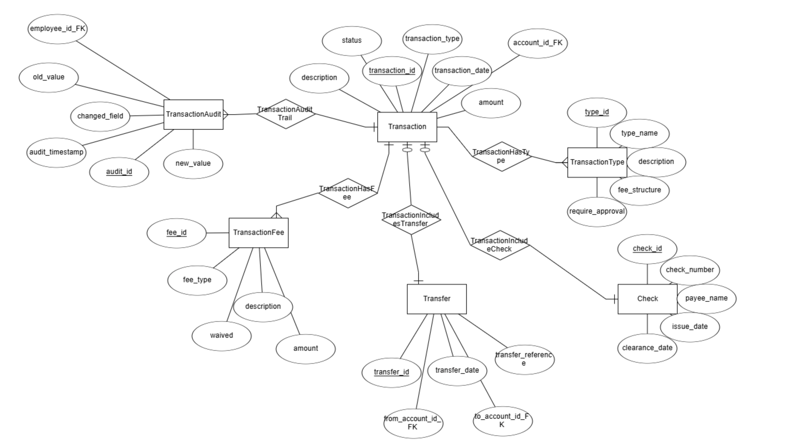
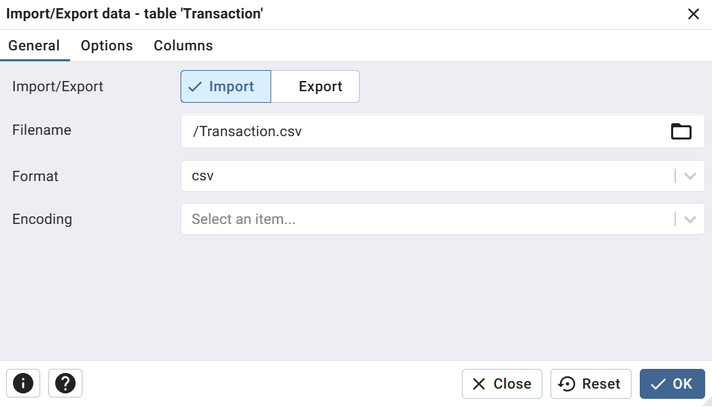
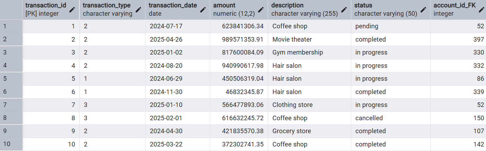
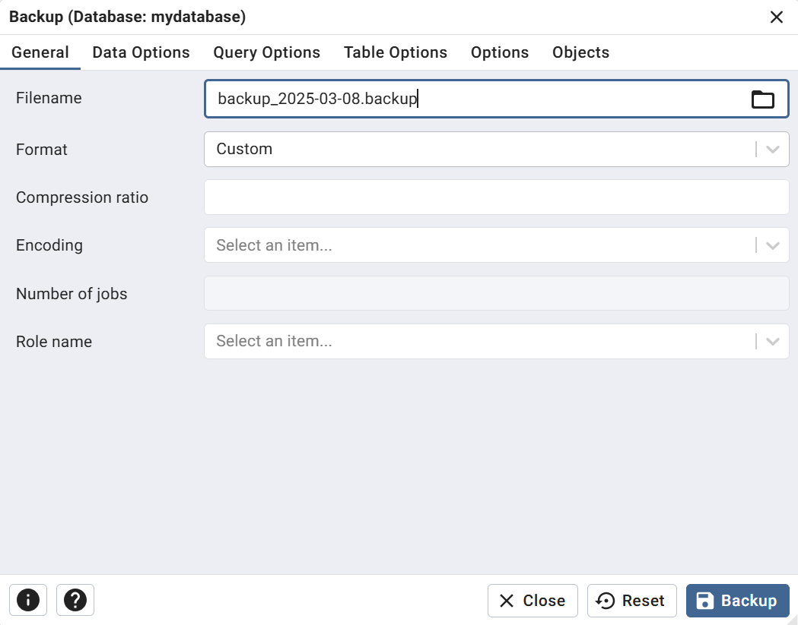

## Project Report - Stage 1

# DBProject_5424_2546

**Authors:** Ruben Bensimon & Ethan Sarfati

**System:** Bank 

**Selected Unit:** Transaction schema with six tables: `Transaction`, `transactionFee`, `transactionType`, `transfer`, `check`, and `transactionAudit`

---

## Table of Contents

1. [Introduction](#introduction)
2. [ERD & DSD Diagrams](#erd--dsd-diagrams)
3. [Design Decisions](#design-decisions)
4. [Data Insertion Methods](#data-insertion-methods)

   * [File Import Method](#file-import-method)
   * [Programming Method](#programming-method)
   * [Mockaroo / GenerateData Method](#mockaroo--generatedata-method)
5. [Backup & Restore](#backup--restore)

---

## Introduction

This project implements a **bank transaction management system** that records and processes financial transactions across six interconnected tables. The **core** of the system is the **`Transaction`** table, which captures:

* A unique **transaction\_id** for each transaction.
* The **type** of transaction (`transaction_type`): deposit, withdrawal, transfer, check, etc.
* The **date** of the transaction (`transaction_date`).
* The **amount** and optional **description**.
* The **status** (e.g., pending, completed, failed).
* A foreign key to the associated **account** (`account_id_FK`).

Supporting tables include:

* **`transactionFee`** for fee details.
* **`transactionType`** to define categories and fee structures.
* **`transfer`** for transfer-specific attributes.
* **`check`** for check-based transaction metadata.
* **`transactionAudit`** to log any changes made to transaction records (not the primary focus here, but available for audit purposes).

The primary objectives for Stage A are:

1. Design the **schema** for these tables (ERD & DSD).
2. Populate the **`Transaction`** table with sample data via different methods.
3. Demonstrate **backup** and **restore** of the database for reliability.

---

## ERD & DSD Diagrams

Insert your ERD and DSD diagrams below:


*Figure 1: Entity-Relationship Diagram*


*Figure 2: Data Structure Diagram*

---

## Table Schemas

Below are the six core tables and their column definitions as configured in pgAdmin:

### Transaction

| Column            | Data Type     | Not Null | Primary Key | Default      |
| ----------------- | ------------- | -------- | ----------- | ------------ |
| transaction\_id   | integer       | Yes      | Yes         | nextval(...) |
| transaction\_type | varchar       | Yes      | No          |              |
| transaction\_date | date          | Yes      | No          |              |
| amount            | numeric(12,2) | Yes      | No          |              |
| description       | varchar(255)  | No       | No          |              |
| status            | varchar(50)   | No       | No          |              |
| account\_id\_FK   | integer       | Yes      | No          |              |

### transactionFee

| Column          | Data Type     | Not Null | Primary Key | Default      |
| --------------- | ------------- | -------- | ----------- | ------------ |
| fee\_id         | integer       | Yes      | Yes         | nextval(...) |
| transaction\_id | integer       | Yes      | No          |              |
| fee\_type       | varchar(50)   | Yes      | No          |              |
| amount          | numeric(10,2) | Yes      | No          |              |
| description     | varchar(255)  | No       | No          |              |
| waived          | boolean       | Yes      | No          |              |

### transactionType

| Column            | Data Type    | Not Null | Primary Key | Default      |
| ----------------- | ------------ | -------- | ----------- | ------------ |
| type\_id          | integer      | Yes      | Yes         | nextval(...) |
| type\_name        | varchar(50)  | Yes      | No          |              |
| description       | varchar(255) | No       | No          |              |
| fee\_structure    | varchar(100) | No       | No          |              |
| require\_approval | char(3)      | Yes      | No          |              |

### transfer

| Column                | Data Type    | Not Null | Primary Key | Default      |
| --------------------- | ------------ | -------- | ----------- | ------------ |
| transfer\_id          | integer      | Yes      | Yes         | nextval(...) |
| transaction\_id       | integer      | Yes      | No          |              |
| from\_account\_id\_FK | integer      | Yes      | No          |              |
| to\_account\_id\_fk   | integer      | Yes      | No          |              |
| transfer\_reference   | varchar(100) | No       | No          |              |
| transfer\_date        | date         | Yes      | No          |              |

### check

| Column          | Data Type   | Not Null | Primary Key | Default |
| --------------- | ----------- | -------- | ----------- | ------- |
| checks\_id      | integer     | Yes      | Yes         |         |
| transaction\_id | integer     | No       | No          |         |
| checks\_number  | varchar(50) | No       | No          |         |
| payee\_name     | varchar(50) | No       | No          |         |
| issue\_date     | date        | No       | No          |         |
| clearance\_date | date        | No       | No          |         |

### transactionAudit

| Column           | Data Type    | Not Null | Primary Key | Default      |
| ---------------- | ------------ | -------- | ----------- | ------------ |
| audit\_id        | integer      | Yes      | Yes         | nextval(...) |
| transaction\_id  | integer      | Yes      | No          |              |
| audit\_timestamp | date         | Yes      | No          |              |
| changed\_field   | varchar(100) | Yes      | No          |              |
| old\_value       | varchar(255) | No       | No          |              |
| new\_value       | varchar(255) | No       | No          |              |
| employee\_id\_FK | varchar(255) | Yes      | No          |              |

---

## Design Decisions

* **Core Table Focus:** We prioritized the `Transaction` table design to ensure accurate capture of financial movements.
* **Primary Key:** `transaction_id` is a serial integer for uniqueness.
* **Data Types:**

  * `transaction_date` as **DATE**, capturing only the calendar date.
  * `amount` as **NUMERIC(12,2)** to handle large values and cents.
  * Textual fields (`description`, `status`) as **VARCHAR**, sized for expected content.
* **Normalization:** Related tables (`transactionType`, `transactionFee`, `transfer`, `check`) store specialized data to avoid null columns in `Transaction`.
* **Audit Table:** `transactionAudit` uses a similar PK approach, but is only populated via triggers or batch processes after insertion.

---

## Data Insertion Methods

To demonstrate data loading into the **`Transaction`** table, we employed three approaches:

### 1. File Import Method (CSV generated by Mockaroo)

* **CSV Generation**: Used **Mockaroo** to generate a CSV file with fields matching the `Transaction` schema.
* **Import via pgAdmin**: In pgAdmin, right-click **`Transaction`** → **Import/Export Data…** → select the Mockaroo-generated CSV → map columns → execute.



*Figure 3: Importing `Transaction` CSV via pgAdmin*

### 2. Programming Method (Python + psycopg2)

A Python script automates ingestion:

1. **Dependencies**: `pip install pandas psycopg2-binary openpyxl`
2. **Load & Prepare**:

   ```python
   df = pd.read_excel('transactions_sample.xlsx')
   df['transaction_date'] = pd.to_datetime(df['transaction_date']).dt.date
   ```
3. **Database Insertion**:

   ```python
   conn = psycopg2.connect(...)
   cur = conn.cursor()
   cur.execute('CREATE TABLE IF NOT EXISTS "Transaction" (...)')
   for _, row in df.iterrows():
       cur.execute(
           "INSERT INTO \"Transaction\" (...) VALUES (%s, ...)",
           (row['transaction_type'], row['transaction_date'], ...)
       )
   conn.commit()
   cur.close()
   conn.close()
   ```


*Figure 4: Python script importing into `Transaction`*

### 3. SQL Generation Method (AI-generated)

* **Generation**: Used an **AI tool** to produce bulk `INSERT` statements aligned with the `Transaction` schema.
* **Execution**: Paste the AI-generated SQL into pgAdmin’s Query Tool and run.


*Figure 5: AI-generated SQL for `Transaction`* Backup & Restore

We used pgAdmin **Backup** for reliable backups:

* **Backup:**

*Figure 6: pgAdmin backup dialog*
* **Restore:**

We used pgAdmin **Restore** for reliable restore:


*Figure 7: Restored database tables in pgAdmin*

---

*End of Stage 1 Report*

---
---

# 📊 Database Project – Stage 2: Queries and Constraints

This document details the objectives, deliverables, and structure of stage 2 of the database project. This phase is centered around advanced SQL usage, data integrity via constraints, and safe transactional control.

---

## 🎯 Stage 2 Goals

The aim of this phase is to demonstrate your ability to:

1. **Formulate complex SQL queries** that provide meaningful insights from multiple tables.
2. **Manipulate and clean data** using `DELETE` and `UPDATE` statements based on real business logic.
3. **Ensure data consistency** through explicit SQL constraints.
4. **Safely manage database changes** using PostgreSQL transaction commands (`ROLLBACK`, `COMMIT`).

---

## 📁 Deliverables and File Descriptions

### ✅ `queries.sql`

This file contains:

* **8 non-trivial `SELECT` queries** using:
  * Multi-table joins (`JOIN`)
  * Date manipulation (`TO_CHAR`)
  * Aggregation (`SUM`, `AVG`, `COUNT`)
  * Subqueries and filters
* Each query returns **more than 2 columns** and provides insights that would be useful for GUI display (e.g. transaction details, user-friendly names, monthly summaries).
* **3 `DELETE` queries**, carefully designed to:
  * Remove waived fees under specific conditions
  * Clean old or orphaned data (e.g. transfers without valid transactions)
* **3 `UPDATE` queries** to:
  * Automatically set default descriptions where missing
  * Archive or finalize old transactions
  * Modify large fees to simulate dynamic policy changes

> ✅ Queries use double quotes for table and column names to respect PostgreSQL case sensitivity (e.g. `"Transaction"` vs `transaction`).

---

### ✅ `constraints.sql`

This script applies **3 key constraints** to improve data quality and enforce business rules:

* `NOT NULL` on `"Transaction"."status"` to ensure every transaction has a defined state.
* `CHECK (amount > 0)` on `"TransactionFee"."amount"` to avoid negative or zero-value fees.
* `DEFAULT 'no'` on `"TransactionFee"."waived"` to ensure fees are not waived unless explicitly defined.

> These constraints simulate real-world enforcement rules within a banking or transaction system.

---

### ✅ `transactions.sql`

This file demonstrates **manual control of transactions** using:

#### 🔁 **ROLLBACK Transaction**
* Starts a transaction with `BEGIN`
* Applies a temporary update (e.g., archiving old transactions)
* Rolls back the change with `ROLLBACK`
* Verifies that the original values are restored

#### 💾 **COMMIT Transaction**
* Starts a transaction
* Updates records (e.g., setting fees to waived for high-value ATM charges)
* Saves the changes using `COMMIT`
* Confirms that the changes are now permanent

> These scenarios reflect **safe update procedures**, which are essential in production environments to avoid data corruption.


---

## 🔍 Expected Results & Testing Tips

* **SELECT queries** should return user-friendly, readable information (e.g., type names, amounts, formatted dates).
* **DELETE and UPDATE queries** should show row modifications when you run `SELECT COUNT(*)` before and after.
* **ROLLBACK** must undo all changes in a transaction.
* **COMMIT** should make updates persistent even after reconnecting to the DB.
* **Constraints** should be tested by attempting to insert invalid data (e.g., a negative fee).

---

*End of Stage 2*


# 📦 Database Project – Stage 3: Integration and Views

This document summarizes the work done during Stage G, which focused on integrating two departmental database schemas and designing meaningful SQL views.

---

## 📌 Overview

- **Main project:** Transaction Management System
- **Integrated module:** Account Management System
- **Tools used:** PostgreSQL, pgAdmin, ERDPlus

---

## 🔗 Integration Process

1. Restored the external backup containing the Account module.
2. Reconstructed its **DSD** and generated a matching **ERD**.
3. Merged both ERDs into a unified **Integrated ERD**.
4. Created all missing tables in our main database (Transaction).
5. Added relevant FOREIGN KEY constraints between modules.
6. Populated tables with representative test data.

---

## 📸 Diagrams and Screenshots

### 📂 1. DSD of the integrated module (Account)


### 📂 2. ERD of the integrated module


### 📂 3. Unified ERD after integration


### 📂 4. Final DSD after integration


---

## 🧱 SQL Integration Script

- File: `Integrate.sql`
- Description: Contains all `CREATE TABLE` and `ALTER TABLE` statements to integrate the modules, without deleting existing data.

---

## 👁️ SQL Views

- File: `Views.sql`
- Description: Contains two views with JOINs, and two meaningful queries per view

### 👀 View 1: `TransactionOverviewView`

Displays transactions with type, status, and associated account:

```sql
SELECT * FROM TransactionOverviewView ;
```


#### Query 1 – Transactions of type 'withdrawal'
```sql
SELECT * FROM TransactionOverviewView WHERE type_name = 'purhase';
```


#### Query 2 – Average amount per type
```sql
SELECT type_name, AVG(amount) FROM TransactionOverviewView GROUP BY type_name;
```


---

### 👀 View 2: `AccountSummaryView`

Displays account activities joined with account info:

```sql
SELECT * FROM AccountSummaryView ;
```


#### Query 1 – Activities with amount > 1000
```sql
SELECT * FROM AccountSummaryView WHERE amount > 1000;
```


#### Query 2 – Activity count per type
```sql
SELECT activity_type, COUNT(*) FROM AccountSummaryView GROUP BY activity_type;
```


---

## 📤 Files to Submit (Git)

- `Integrate.sql`
- `Views.sql`
- `backup3.backup`
- `README.md`
- All diagram and view result screenshots listed above

---

end of stage 3

# 📑 Database Project – Stage 4: PL/pgSQL Routines and Triggers

This folder contains the deliverables for **Stage 4** of the database project. The goal of this phase is to extend the system with stored functions, procedures, and triggers written in PL/pgSQL and demonstrate their usage with sample programs.

## Directory Overview

- **SQL Requests/** – source code for functions, procedures, triggers and example programs
- **backup4.backup** – PostgreSQL backup after completing Stage 4
- **pictures/** – screenshots showing the routines in action

## Functions

File: `SQL Requests/functions.sql`

### `calculate_total_fees`

Returns the total non‑waived fees for an account over a given period.

```sql
CREATE OR REPLACE FUNCTION calculate_total_fees(
    acc_id INT,
    start_period DATE,
    end_period DATE
) RETURNS NUMERIC AS $$
DECLARE
    total_fees NUMERIC := 0;
BEGIN
    SELECT COALESCE(SUM(tf.amount),0)
    INTO total_fees
    FROM "TransactionFee" tf
    INNER JOIN "Transaction" t ON tf.transaction_id = t.transaction_id
    WHERE t."account_id_FK" = acc_id
      AND t.transaction_date BETWEEN start_period AND end_period
      AND tf.waived = 'NO';

    RETURN total_fees;
EXCEPTION
    WHEN OTHERS THEN
        RAISE EXCEPTION 'Erreur lors du calcul des frais : %', SQLERRM;
END;
$$ LANGUAGE plpgsql;
```


### `get_active_restrictions`

Lists the currently active restrictions for an account.

```sql
CREATE OR REPLACE FUNCTION get_active_restrictions(acc_id INT)
RETURNS TEXT AS $$
DECLARE
    restriction RECORD;
    result TEXT := '';
    today DATE := CURRENT_DATE;
BEGIN
    FOR restriction IN
        SELECT "restriction_type", "reason", "start_date", "end_date"
        FROM AccountRestriction
        WHERE "account_id" = acc_id
          AND "start_date" <= today
          AND ("end_date" IS NULL OR "end_date" >= today)
    LOOP
        result := result || FORMAT(
            'Restriction: %s | Raison: %s | Du: %s Au: %s; ',
            restriction.restriction_type,
            restriction.reason,
            restriction.start_date,
            COALESCE(restriction.end_date::TEXT, 'Indéfini')
        );
    END LOOP;

    IF result = '' THEN
        result := 'Aucune restriction active.';
    END IF;

    RETURN result;
EXCEPTION
    WHEN OTHERS THEN
        RAISE EXCEPTION 'Erreur lors de la vérification des restrictions : %', SQLERRM;
END;
$$ LANGUAGE plpgsql;
```


## Procedures

File: `SQL Requests/procedures.sql`

### `update_inactive_accounts`

Marks accounts without recent activity as inactive.

```sql
CREATE OR REPLACE PROCEDURE update_inactive_accounts()
LANGUAGE plpgsql
AS $$
DECLARE
    r RECORD;
BEGIN
    FOR r IN
        SELECT "account_id"
        FROM "account"
        WHERE "status" = 'active'
          AND NOT EXISTS (
              SELECT 1
              FROM "accountactivity"
              WHERE "account_id" = "account"."account_id"
                AND "activity_date" >= CURRENT_DATE - INTERVAL '180 days'
          )
    LOOP
        UPDATE "account"
        SET "status" = 'inactive'
        WHERE "account_id" = r."account_id";

        RAISE NOTICE 'Compte % marqué inactif', r."account_id";
    END LOOP;
EXCEPTION
    WHEN OTHERS THEN
        RAISE EXCEPTION 'Erreur dans update_inactive_accounts : %', SQLERRM;
END;
$$;
```


### `check_and_block_account_if_overdraft`

Blocks an account and adds a restriction if the balance falls below a threshold.

```sql
CREATE OR REPLACE PROCEDURE check_and_block_account_if_overdraft(
    acc_id INT,
    seuil_negatif NUMERIC
)
LANGUAGE plpgsql
AS $$
DECLARE
    solde NUMERIC;
BEGIN
    -- Vérifier que le compte existe
    IF NOT EXISTS (
        SELECT 1 FROM "account" WHERE "account_id" = acc_id
    ) THEN
        RAISE EXCEPTION 'Le compte % n''existe pas.', acc_id;
    END IF;

    -- Récupérer le solde actuel
    SELECT "current_balan"
    INTO solde
    FROM "account"
    WHERE "account_id" = acc_id;

    -- Si le solde est en dessous du seuil, bloquer le compte
    IF solde < seuil_negatif THEN

        -- Mettre à jour le statut du compte
        UPDATE "account"
        SET "status" = 'blocked'
        WHERE "account_id" = acc_id;

        -- Ajouter une restriction complète
        INSERT INTO "accountrestriction" (
            "account_id",
            "restriction_type",
            "start_date",
            "reason"
        ) VALUES (
            acc_id,
            'Full',
            CURRENT_DATE,
            'Solde insuffisant (en dessous de ' || seuil_negatif || ')'
        );

        RAISE NOTICE 'Compte % bloqué pour dépassement de découvert.', acc_id;

    ELSE
        RAISE NOTICE 'Aucune action nécessaire. Solde actuel : %', solde;
    END IF;

EXCEPTION
    WHEN OTHERS THEN
        RAISE EXCEPTION 'Erreur dans check_and_block_account_if_overdraft : %', SQLERRM;
END;
$$;
```


Example calls and outputs are illustrated in the screenshots:


## Triggers

File: `SQL Requests/triggers.sql`

### `log_transaction_update`

Records significant updates to transactions in an audit table.

```sql
CREATE OR REPLACE FUNCTION log_transaction_update()
RETURNS TRIGGER AS $$
DECLARE
    field TEXT;
    old_val TEXT;
    new_val TEXT;
BEGIN
    IF NEW."amount" IS DISTINCT FROM OLD."amount" THEN
        field := 'amount';
        old_val := OLD."amount"::TEXT;
        new_val := NEW."amount"::TEXT;
    ELSIF NEW."status" IS DISTINCT FROM OLD."status" THEN
        field := 'status';
        old_val := OLD."status";
        new_val := NEW."status";
    ELSIF NEW."description" IS DISTINCT FROM OLD."description" THEN
        field := 'description';
        old_val := OLD."description";
        new_val := NEW."description";
    ELSE
        RETURN NEW;
    END IF;

    INSERT INTO "transaction_audit" (
        "transaction_id",
        "audit_timestamp",
        "changed_field",
        "old_value",
        "new_value",
        "employee_id_FK"
    ) VALUES (
        NEW."transaction_id",
        CURRENT_TIMESTAMP,
        field,
        old_val,
        new_val,
        NULL
    );

    RETURN NEW;
END;
$$ LANGUAGE plpgsql;

CREATE TRIGGER trg_log_transaction_update
AFTER UPDATE ON "Transaction"
FOR EACH ROW
EXECUTE FUNCTION log_transaction_update();
```


### `update_account_balance_after_activity`

Adjusts an account balance after inserting a new activity.

```sql
CREATE OR REPLACE FUNCTION update_account_balance_after_activity()
RETURNS TRIGGER AS $$
BEGIN
    UPDATE "account"
    SET "current_balan" = "current_balan" + NEW."amount"
    WHERE "account_id" = NEW."account_id";

    RETURN NEW;
END;
$$ LANGUAGE plpgsql;

CREATE TRIGGER trg_update_account_balance
AFTER INSERT ON "accountactivity"
FOR EACH ROW
EXECUTE FUNCTION update_account_balance_after_activity();
```


## Sample Programs

Two SQL scripts demonstrate the routines:

- `programme_principal1.sql` – computes total fees for account `270` in 2025 and invokes the overdraft check procedure.
  
  
- `programme_principal2.sql` – showcases cursor usage (requires a function `get_transactions_by_status`).
  
  

Additional screenshots show query results:


---

End of Stage 4
