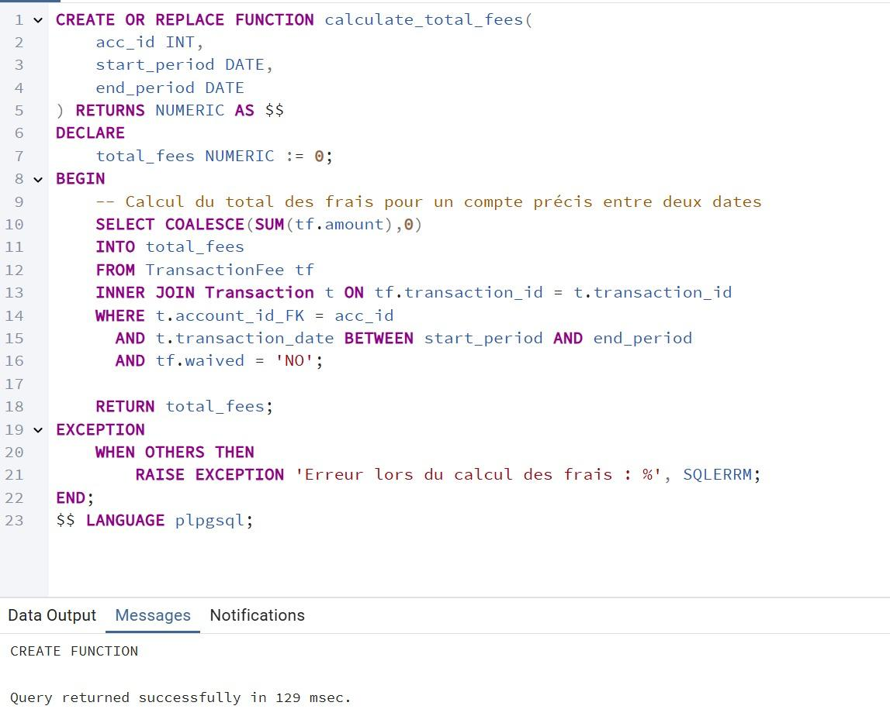
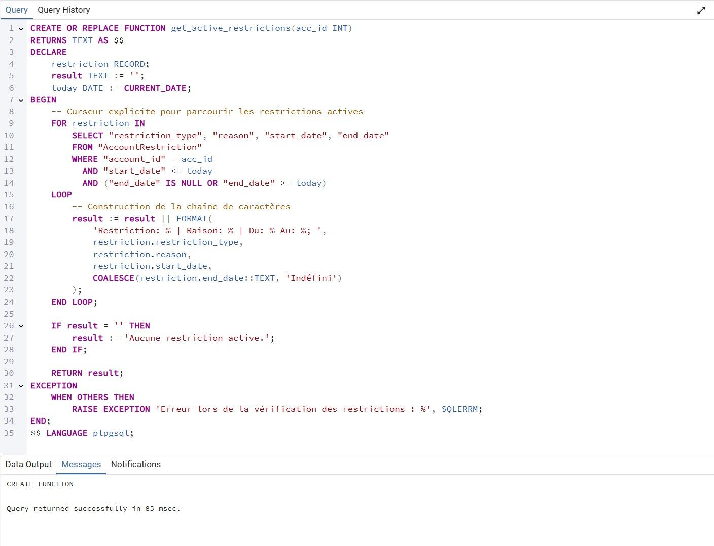
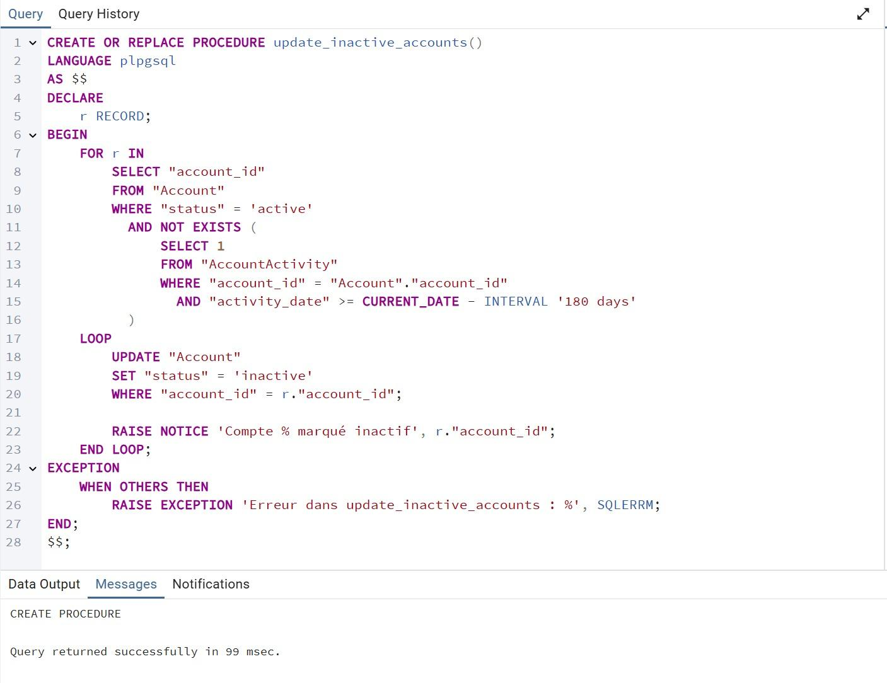
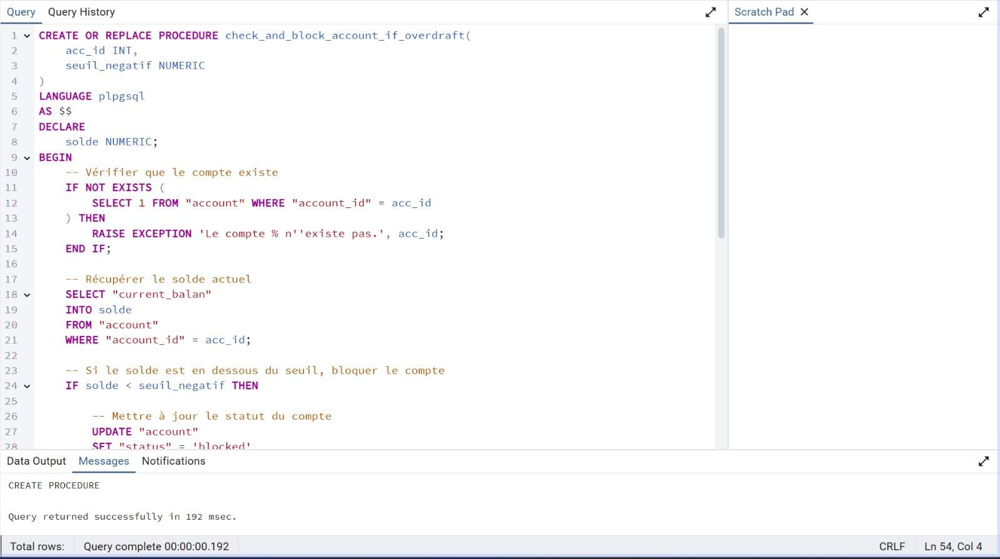
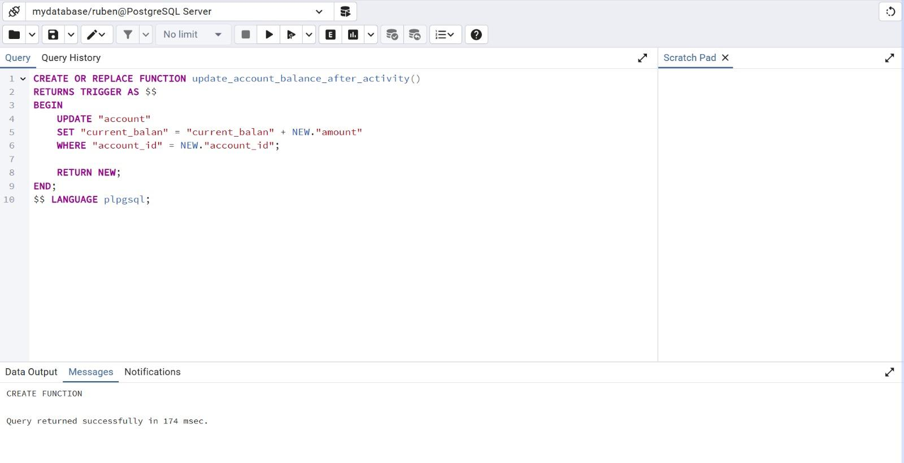

# 📑 Database Project – Stage 4: PL/pgSQL Routines and Triggers

This folder contains the deliverables for **Stage 4** of the database project. The goal of this phase is to extend the system with stored functions, procedures, and triggers written in PL/pgSQL and demonstrate their usage with sample programs.

## Directory Overview

- **SQL Requests/** – source code for functions, procedures, triggers and example programs
- **backup4.backup** – PostgreSQL backup after completing Stage 4
- **pictures/** – screenshots showing the routines in action

## Functions

File: `SQL Requests/functions.sql`

### `calculate_total_fees`

Returns the total non‑waived fees for an account over a given period.

```sql
CREATE OR REPLACE FUNCTION calculate_total_fees(
    acc_id INT,
    start_period DATE,
    end_period DATE
) RETURNS NUMERIC AS $$
DECLARE
    total_fees NUMERIC := 0;
BEGIN
    SELECT COALESCE(SUM(tf.amount),0)
    INTO total_fees
    FROM "TransactionFee" tf
    INNER JOIN "Transaction" t ON tf.transaction_id = t.transaction_id
    WHERE t."account_id_FK" = acc_id
      AND t.transaction_date BETWEEN start_period AND end_period
      AND tf.waived = 'NO';

    RETURN total_fees;
EXCEPTION
    WHEN OTHERS THEN
        RAISE EXCEPTION 'Erreur lors du calcul des frais : %', SQLERRM;
END;
$$ LANGUAGE plpgsql;
```



### `get_active_restrictions`

Lists the currently active restrictions for an account.

```sql
CREATE OR REPLACE FUNCTION get_active_restrictions(acc_id INT)
RETURNS TEXT AS $$
DECLARE
    restriction RECORD;
    result TEXT := '';
    today DATE := CURRENT_DATE;
BEGIN
    FOR restriction IN
        SELECT "restriction_type", "reason", "start_date", "end_date"
        FROM AccountRestriction
        WHERE "account_id" = acc_id
          AND "start_date" <= today
          AND ("end_date" IS NULL OR "end_date" >= today)
    LOOP
        result := result || FORMAT(
            'Restriction: %s | Raison: %s | Du: %s Au: %s; ',
            restriction.restriction_type,
            restriction.reason,
            restriction.start_date,
            COALESCE(restriction.end_date::TEXT, 'Indéfini')
        );
    END LOOP;

    IF result = '' THEN
        result := 'Aucune restriction active.';
    END IF;

    RETURN result;
EXCEPTION
    WHEN OTHERS THEN
        RAISE EXCEPTION 'Erreur lors de la vérification des restrictions : %', SQLERRM;
END;
$$ LANGUAGE plpgsql;
```



## Procedures

File: `SQL Requests/procedures.sql`

### `update_inactive_accounts`

Marks accounts without recent activity as inactive.

```sql
CREATE OR REPLACE PROCEDURE update_inactive_accounts()
LANGUAGE plpgsql
AS $$
DECLARE
    r RECORD;
BEGIN
    FOR r IN
        SELECT "account_id"
        FROM "account"
        WHERE "status" = 'active'
          AND NOT EXISTS (
              SELECT 1
              FROM "accountactivity"
              WHERE "account_id" = "account"."account_id"
                AND "activity_date" >= CURRENT_DATE - INTERVAL '180 days'
          )
    LOOP
        UPDATE "account"
        SET "status" = 'inactive'
        WHERE "account_id" = r."account_id";

        RAISE NOTICE 'Compte % marqué inactif', r."account_id";
    END LOOP;
EXCEPTION
    WHEN OTHERS THEN
        RAISE EXCEPTION 'Erreur dans update_inactive_accounts : %', SQLERRM;
END;
$$;
```



### `check_and_block_account_if_overdraft`

Blocks an account and adds a restriction if the balance falls below a threshold.

```sql
CREATE OR REPLACE PROCEDURE check_and_block_account_if_overdraft(
    acc_id INT,
    seuil_negatif NUMERIC
)
LANGUAGE plpgsql
AS $$
DECLARE
    solde NUMERIC;
BEGIN
    -- Vérifier que le compte existe
    IF NOT EXISTS (
        SELECT 1 FROM "account" WHERE "account_id" = acc_id
    ) THEN
        RAISE EXCEPTION 'Le compte % n''existe pas.', acc_id;
    END IF;

    -- Récupérer le solde actuel
    SELECT "current_balan"
    INTO solde
    FROM "account"
    WHERE "account_id" = acc_id;

    -- Si le solde est en dessous du seuil, bloquer le compte
    IF solde < seuil_negatif THEN

        -- Mettre à jour le statut du compte
        UPDATE "account"
        SET "status" = 'blocked'
        WHERE "account_id" = acc_id;

        -- Ajouter une restriction complète
        INSERT INTO "accountrestriction" (
            "account_id",
            "restriction_type",
            "start_date",
            "reason"
        ) VALUES (
            acc_id,
            'Full',
            CURRENT_DATE,
            'Solde insuffisant (en dessous de ' || seuil_negatif || ')'
        );

        RAISE NOTICE 'Compte % bloqué pour dépassement de découvert.', acc_id;

    ELSE
        RAISE NOTICE 'Aucune action nécessaire. Solde actuel : %', solde;
    END IF;

EXCEPTION
    WHEN OTHERS THEN
        RAISE EXCEPTION 'Erreur dans check_and_block_account_if_overdraft : %', SQLERRM;
END;
$$;
```



Example calls and outputs are illustrated in the screenshots:


## Triggers

File: `SQL Requests/triggers.sql`

### `log_transaction_update`

Records significant updates to transactions in an audit table.

```sql
CREATE OR REPLACE FUNCTION log_transaction_update()
RETURNS TRIGGER AS $$
DECLARE
    field TEXT;
    old_val TEXT;
    new_val TEXT;
BEGIN
    IF NEW."amount" IS DISTINCT FROM OLD."amount" THEN
        field := 'amount';
        old_val := OLD."amount"::TEXT;
        new_val := NEW."amount"::TEXT;
    ELSIF NEW."status" IS DISTINCT FROM OLD."status" THEN
        field := 'status';
        old_val := OLD."status";
        new_val := NEW."status";
    ELSIF NEW."description" IS DISTINCT FROM OLD."description" THEN
        field := 'description';
        old_val := OLD."description";
        new_val := NEW."description";
    ELSE
        RETURN NEW;
    END IF;

    INSERT INTO "transaction_audit" (
        "transaction_id",
        "audit_timestamp",
        "changed_field",
        "old_value",
        "new_value",
        "employee_id_FK"
    ) VALUES (
        NEW."transaction_id",
        CURRENT_TIMESTAMP,
        field,
        old_val,
        new_val,
        NULL
    );

    RETURN NEW;
END;
$$ LANGUAGE plpgsql;

CREATE TRIGGER trg_log_transaction_update
AFTER UPDATE ON "Transaction"
FOR EACH ROW
EXECUTE FUNCTION log_transaction_update();
```


### `update_account_balance_after_activity`

Adjusts an account balance after inserting a new activity.

```sql
CREATE OR REPLACE FUNCTION update_account_balance_after_activity()
RETURNS TRIGGER AS $$
BEGIN
    UPDATE "account"
    SET "current_balan" = "current_balan" + NEW."amount"
    WHERE "account_id" = NEW."account_id";

    RETURN NEW;
END;
$$ LANGUAGE plpgsql;

CREATE TRIGGER trg_update_account_balance
AFTER INSERT ON "accountactivity"
FOR EACH ROW
EXECUTE FUNCTION update_account_balance_after_activity();
```




## Sample Programs

Two SQL scripts demonstrate the routines:

- `programme_principal1.sql` – computes total fees for account `270` in 2025 and invokes the overdraft check procedure.
  
  
- `programme_principal2.sql` – showcases cursor usage (requires a function `get_transactions_by_status`).
  
  

Additional screenshots show query results:


---

End of Stage 4
