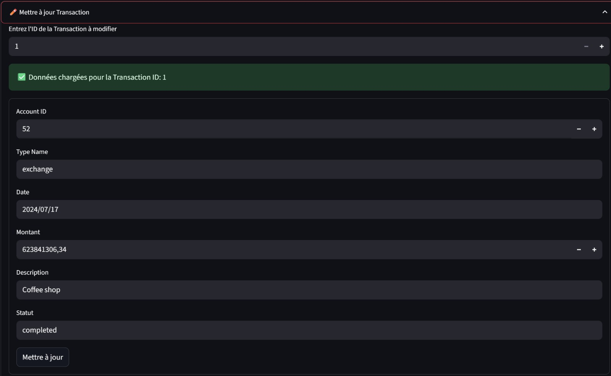

# Stage 5 – GUI Application

This stage introduces a Streamlit-based interface to manage the database created in previous stages. The GUI lets you perform CRUD operations and run custom reports.

## Directory Overview

- **GUI/** – the Streamlit application and ORM models
- **pictures/** – add screenshots for this stage here

## Requirements

Install the following Python packages:

```bash
pip install streamlit sqlalchemy psycopg2-binary pandas
```

These packages are used by `GUI/streamlit_app.py` and the ORM models in `GUI/stage5.py`.

## Database connection

The application relies on the SQLAlchemy models defined in `GUI/stage5.py`. At the top of this file you will find the connection parameters:

```python
DB_USER = "ruben"
DB_PASSWORD = "2810"
DB_HOST = "localhost"
DB_PORT = "5432"
DB_NAME = "mydatabase"
```

Adjust these values (or export matching environment variables before launching the app) so they point to your PostgreSQL instance.

## Running the application

1. Ensure PostgreSQL is up and that the connection values in `stage5.py` (or the corresponding environment variables) point to your server.
2. Install the required packages using `pip` if you have not already done so.
3. From the `stage 5/GUI` directory, launch Streamlit:

```bash
streamlit run streamlit_app.py
```

4. Open the URL printed by Streamlit (typically `http://localhost:8501/`) in your browser.
5. Log in with the credentials defined in `streamlit_app.py` (`ruben` / `2810` by default).

## Screen overview

### Login
The first screen prompts for a username and password. Only after a successful login can you access the rest of the application.


### CRUD tab
After logging in, the app displays two tabs.
The **CRUD** tab lets you:

1. Select one of four tables: `Transaction`, `Transfer`, `Check`, or `Account`.
2. View the current rows in the selected table.
3. Add, update or delete records via expandable forms.




### Rapports tab
The **Rapports** tab provides a few reporting tools:

- "Totaux mensuels par type" – displays monthly totals for transaction types.
- "Transactions > 1 000 000" – lists large transactions above a configurable threshold.
- Buttons to execute the stored procedures `update_inactive_accounts` and `check_and_block_overdrafts`.


## Workflow and tools

The GUI was built iteratively using **Streamlit** for rapid prototyping and **SQLAlchemy** for the database layer. We wrote the code in VS Code and tracked changes in **git**. Each feature was tested locally against a PostgreSQL instance before committing. The screenshots and diagrams in earlier stages were produced with pgAdmin and standard screenshot utilities.

---
End of Stage 5
