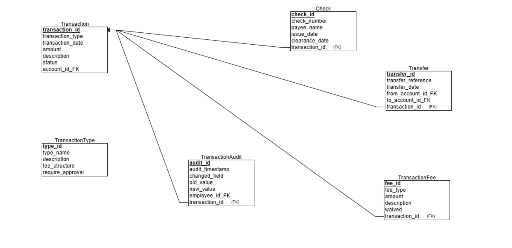
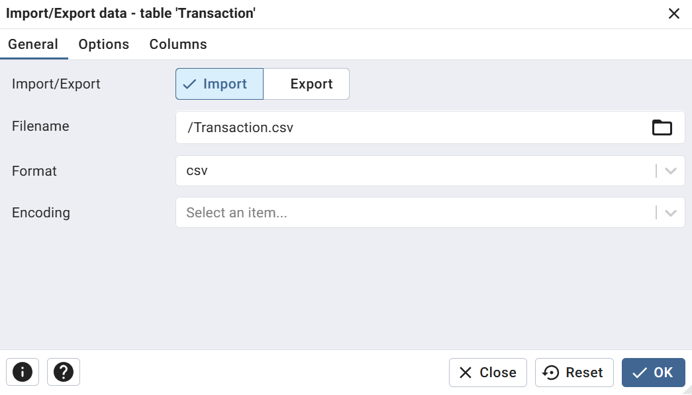
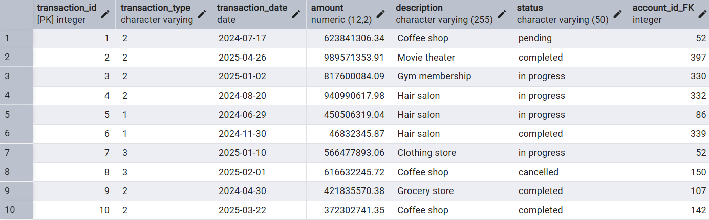
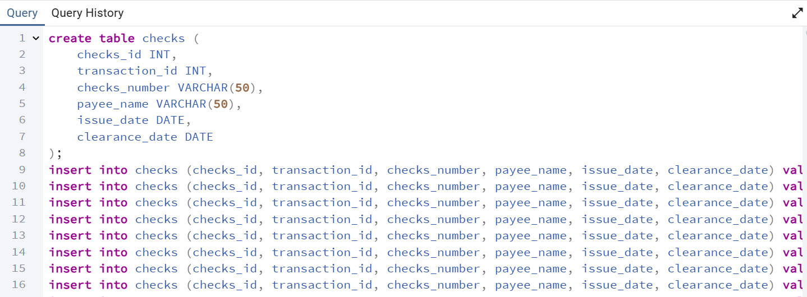
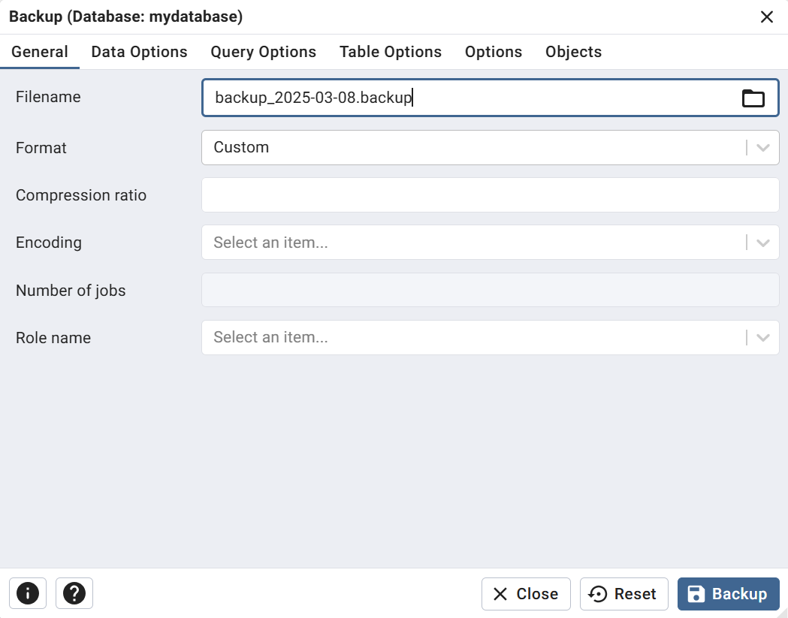
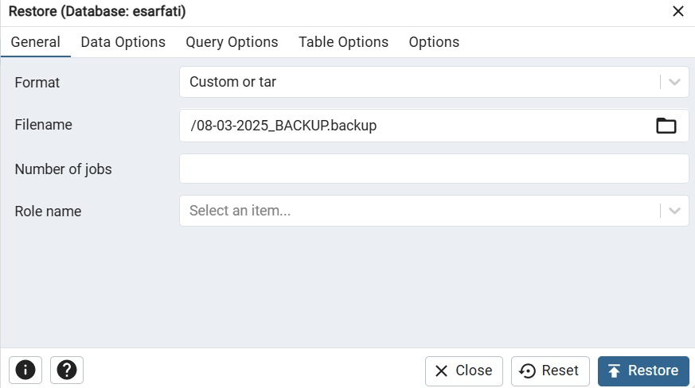
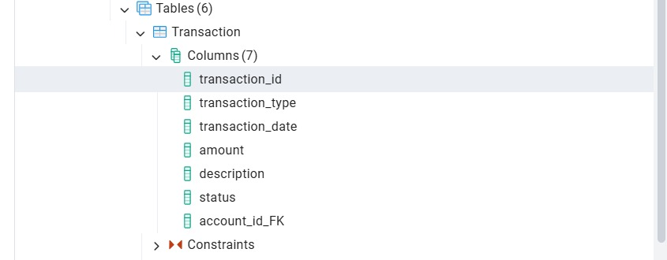

## Project Report - Stage 1

# DBProject_5424_2546

**Authors:** Ruben Bensimon & Ethan Sarfati

**System:** Bank&#x20;

**Selected Unit:** Transaction schema with six tables: `Transaction`, `transactionFee`, `transactionType`, `transfer`, `check`, and `transactionAudit`

---

## Table of Contents

1. [Introduction](#introduction)
2. [ERD & DSD Diagrams](#erd--dsd-diagrams)
3. [Design Decisions](#design-decisions)
4. [Data Insertion Methods](#data-insertion-methods)

   * [File Import Method](#file-import-method)
   * [Programming Method](#programming-method)
   * [Mockaroo / GenerateData Method](#mockaroo--generatedata-method)
5. [Backup & Restore](#backup--restore)

---

## Introduction

This project implements a **bank transaction management system** that records and processes financial transactions across six interconnected tables. The **core** of the system is the **`Transaction`** table, which captures:

* A unique **transaction\_id** for each transaction.
* The **type** of transaction (`transaction_type`): deposit, withdrawal, transfer, check, etc.
* The **date** of the transaction (`transaction_date`).
* The **amount** and optional **description**.
* The **status** (e.g., pending, completed, failed).
* A foreign key to the associated **account** (`account_id_FK`).

Supporting tables include:

* **`transactionFee`** for fee details.
* **`transactionType`** to define categories and fee structures.
* **`transfer`** for transfer-specific attributes.
* **`check`** for check-based transaction metadata.
* **`transactionAudit`** to log any changes made to transaction records (not the primary focus here, but available for audit purposes).

The primary objectives for Stage A are:

1. Design the **schema** for these tables (ERD & DSD).
2. Populate the **`Transaction`** table with sample data via different methods.
3. Demonstrate **backup** and **restore** of the database for reliability.

---

## ERD & DSD Diagrams

Insert your ERD and DSD diagrams below:


*Figure 1: Entity-Relationship Diagram*


*Figure 2: Data Structure Diagram*

---

## Table Schemas

Below are the six core tables and their column definitions as configured in pgAdmin:

### Transaction

| Column            | Data Type     | Not Null | Primary Key | Default      |
| ----------------- | ------------- | -------- | ----------- | ------------ |
| transaction\_id   | integer       | Yes      | Yes         | nextval(...) |
| transaction\_type | varchar       | Yes      | No          |              |
| transaction\_date | date          | Yes      | No          |              |
| amount            | numeric(12,2) | Yes      | No          |              |
| description       | varchar(255)  | No       | No          |              |
| status            | varchar(50)   | No       | No          |              |
| account\_id\_FK   | integer       | Yes      | No          |              |

### transactionFee

| Column          | Data Type     | Not Null | Primary Key | Default      |
| --------------- | ------------- | -------- | ----------- | ------------ |
| fee\_id         | integer       | Yes      | Yes         | nextval(...) |
| transaction\_id | integer       | Yes      | No          |              |
| fee\_type       | varchar(50)   | Yes      | No          |              |
| amount          | numeric(10,2) | Yes      | No          |              |
| description     | varchar(255)  | No       | No          |              |
| waived          | boolean       | Yes      | No          |              |

### transactionType

| Column            | Data Type    | Not Null | Primary Key | Default      |
| ----------------- | ------------ | -------- | ----------- | ------------ |
| type\_id          | integer      | Yes      | Yes         | nextval(...) |
| type\_name        | varchar(50)  | Yes      | No          |              |
| description       | varchar(255) | No       | No          |              |
| fee\_structure    | varchar(100) | No       | No          |              |
| require\_approval | char(3)      | Yes      | No          |              |

### transfer

| Column                | Data Type    | Not Null | Primary Key | Default      |
| --------------------- | ------------ | -------- | ----------- | ------------ |
| transfer\_id          | integer      | Yes      | Yes         | nextval(...) |
| transaction\_id       | integer      | Yes      | No          |              |
| from\_account\_id\_FK | integer      | Yes      | No          |              |
| to\_account\_id\_fk   | integer      | Yes      | No          |              |
| transfer\_reference   | varchar(100) | No       | No          |              |
| transfer\_date        | date         | Yes      | No          |              |

### check

| Column          | Data Type   | Not Null | Primary Key | Default |
| --------------- | ----------- | -------- | ----------- | ------- |
| checks\_id      | integer     | Yes      | Yes         |         |
| transaction\_id | integer     | No       | No          |         |
| checks\_number  | varchar(50) | No       | No          |         |
| payee\_name     | varchar(50) | No       | No          |         |
| issue\_date     | date        | No       | No          |         |
| clearance\_date | date        | No       | No          |         |

### transactionAudit

| Column           | Data Type    | Not Null | Primary Key | Default      |
| ---------------- | ------------ | -------- | ----------- | ------------ |
| audit\_id        | integer      | Yes      | Yes         | nextval(...) |
| transaction\_id  | integer      | Yes      | No          |              |
| audit\_timestamp | date         | Yes      | No          |              |
| changed\_field   | varchar(100) | Yes      | No          |              |
| old\_value       | varchar(255) | No       | No          |              |
| new\_value       | varchar(255) | No       | No          |              |
| employee\_id\_FK | varchar(255) | Yes      | No          |              |

---

## Design Decisions

* **Core Table Focus:** We prioritized the `Transaction` table design to ensure accurate capture of financial movements.
* **Primary Key:** `transaction_id` is a serial integer for uniqueness.
* **Data Types:**

  * `transaction_date` as **DATE**, capturing only the calendar date.
  * `amount` as **NUMERIC(12,2)** to handle large values and cents.
  * Textual fields (`description`, `status`) as **VARCHAR**, sized for expected content.
* **Normalization:** Related tables (`transactionType`, `transactionFee`, `transfer`, `check`) store specialized data to avoid null columns in `Transaction`.
* **Audit Table:** `transactionAudit` uses a similar PK approach, but is only populated via triggers or batch processes after insertion.

---

## Data Insertion Methods

To demonstrate data loading into the **`Transaction`** table, we employed three approaches:

### 1. File Import Method (CSV generated by Mockaroo)

* **CSV Generation**: Used **Mockaroo** to generate a CSV file with fields matching the `Transaction` schema.
* **Import via pgAdmin**: In pgAdmin, right-click **`Transaction`** → **Import/Export Data…** → select the Mockaroo-generated CSV → map columns → execute.



*Figure 3: Importing `Transaction` CSV via pgAdmin*

### 2. Programming Method (Python + psycopg2)

A Python script automates ingestion:

1. **Dependencies**: `pip install pandas psycopg2-binary openpyxl`
2. **Load & Prepare**:

   ```python
   df = pd.read_excel('transactions_sample.xlsx')
   df['transaction_date'] = pd.to_datetime(df['transaction_date']).dt.date
   ```
3. **Database Insertion**:

   ```python
   conn = psycopg2.connect(...)
   cur = conn.cursor()
   cur.execute('CREATE TABLE IF NOT EXISTS "Transaction" (...)')
   for _, row in df.iterrows():
       cur.execute(
           "INSERT INTO \"Transaction\" (...) VALUES (%s, ...)",
           (row['transaction_type'], row['transaction_date'], ...)
       )
   conn.commit()
   cur.close()
   conn.close()
   ```


*Figure 4: Python script importing into `Transaction`*

### 3. SQL Generation Method (AI-generated)

* **Generation**: Used an **AI tool** to produce bulk `INSERT` statements aligned with the `Transaction` schema.
* **Execution**: Paste the AI-generated SQL into pgAdmin’s Query Tool and run.


*Figure 5: AI-generated SQL for `Transaction`* Backup & Restore

We used pgAdmin **Backup** for reliable backups:

* **Backup:**

*Figure 6: pgAdmin backup dialog*
* **Restore:**

We used pgAdmin **Restore** for reliable restore:



*Figure 7: Restored database tables in pgAdmin*


---

*End of Stage 1 Report*
